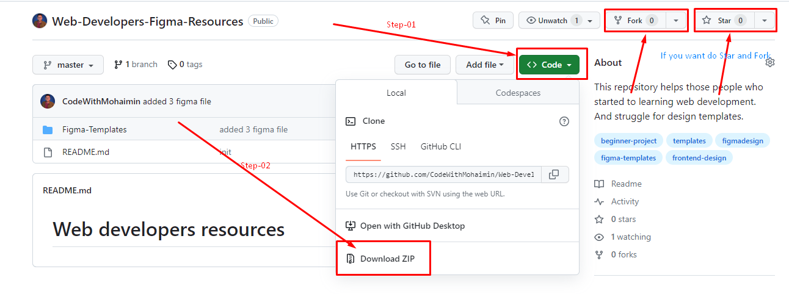
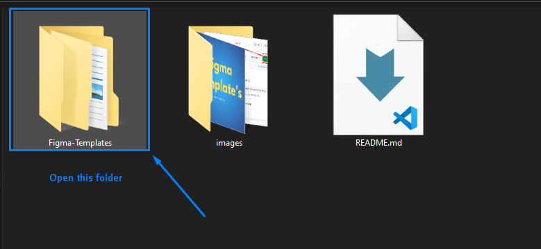

# This repository helps those people who started learning web development. And struggle for finding design templates

## Google Drive - [Download Templates!](https://drive.google.com/drive/folders/1LpP2Nq7290h9hD-OyFJDkC6kmxBnP8CD?usp=sharing "Download files if you want")

## How to use it? Watch this video - [Guide Video!](https://youtu.be/y_zpZSBHZ6E "Download files if you want")

## How To Use This Repository?

This repository is simple to use. Just **Fork** this repository or Download it. And then go to the **Figma-Templates** folder and use it.
**If you can not understand yet please follow steps by step guide**

## Step- 01

**_Fork_** this repository or **_Download_**. And **_Star_** this repository.

## Step- 02

Open this **Figma-Templates** Folder and use those templates

## If you have some Figma templates and you want to contribute to this repository please follow those steps and guidelines

**_Coming Soon..._**
